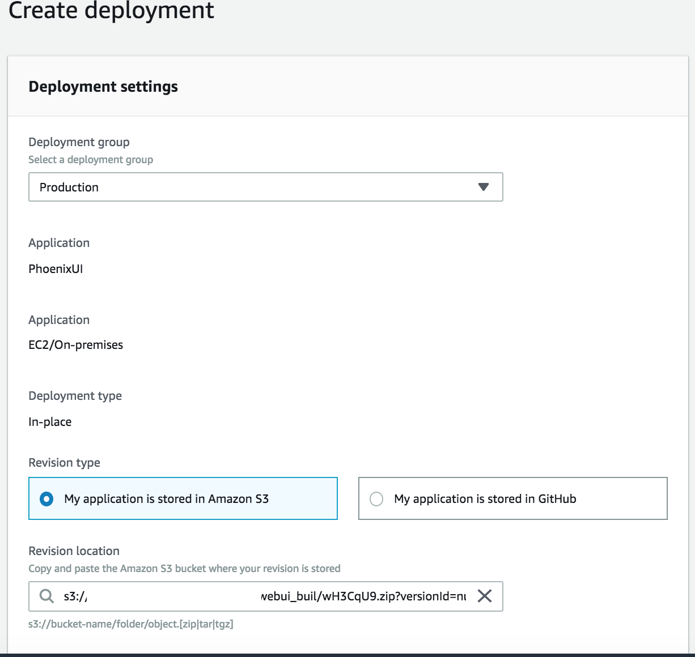

# Deployment Pipeline

As of Oct 23, 2018 production deployment is moved from Bamboo to AWS CodePipeline (and its friends). 
This document outlines how the pieces are wired together, day to day workflow and rollback. 


## State of Bamboo

The old Bamboo build plan for the master branch is still active but it's staging deployment trigger is disabled. 
So, upon merging to `master`, build process will still run and artifacts will, eventually, be ready for deployment to staging and production. 
In case AWS deployment malfunctions, we can manually deploy to staging and production using Bamboo. 

We'll completely decommission Bamboo in near future when AWS Pipeline is completely reliable. 


## Components

AWS CodePipeline is setup with the following components:

  * **CloudFormation**: 
  All the stacks are created using AWS CloudFormation templates. The templates are stored in [ux-cloudformation](https://github.com/SparkPost/ux-cloudformation) repo.
  The repo contains appropriate parameter files for TST and Prod stacks. To update any stack, we should update the template and/or parameter files and use corresponding Stack Name in CloudFormation UI/CLI to apply those updates. 
  
  * **S3**:
  A S3 bucket is created to contain source and deployment artifacts. The *source artifacts* will be used by CodeBuild and *deployment artifacts* will be used by CodeDeploy. Refer to `s3-parameters.json` for S3 bucket name. Same bucket is used by all steps in the pipeline.
  
  * **CodeBuild**:
  CodeBuild is used for CI that pulls the latest source code, install dependency and finally upload the artifacts to S3.
  
  * **CodeDeploy**: 
  CodeDeploy takes the artifacts created by CodeBuild and deploys to hosts.
  
  * **CodePipeline**: 
  CodePipeline glues the build and deploy steps together. When a change is pushed to `master`, it kicks of the pipeline causing CodeBuild and CodeDeploy work sequentially. 
  After CodeDeploy successfully deploys to Tst/Staging, it awaits for approval to deploy to Production. Currently this process is manual and you need to approve it from Pipeline UI Console. FE-565 will allow doing it directly from Slack. 
  
  Once approved, it triggers CodeDeploy to start deployment to Production.   
  
## Workflow
  - Create PR for your changes
  - Get it reviewed
  - Merge into master
    (This will kick of deployment until staging)
  - Verify on Staging
  - Approve Production deployment from AWS Pipeline UI Console
  - Verify on Production
  - Rollback if needed (more on this below)


# Rollback
There isn't rollback feature in CodePipeline but we can effectively rollback by deploying a older version of working app in two ways.

## Option 1: Revert Git Changes
This is simplest. Upon determining current merge is bad, you can revert the changes and take `master` to previous working state.

Given a merge commit named `verybadsplodyboom`, the following command will create a new commit which undoes the offending merge commit:
```sh
git revert -m 1 verybadsplodyboom
```
Once it's pushed, pipeline will kickoff as usual and this will get deployed. However, this may not be fastest as this will again go through whole pipeline.

Note: you can either revert the revert commit later using `git revert` or branch _from the offending merge commit_ to remediate.

## Option 2: Deploy An Old (Working) Build

1. On CodeDeploy interface, in *Revision location* column, click on the item you want to deploy. Be careful to not select item with `Failed` status.

    

1. From next page, click *Create deployment* from top-right

    

1. From *Create Deployment*:

    - Select a deployment group (e.g. Production). Rest should be auto filled in *Deployment settings* section
    - Add a deployment note
    - Select `AllAtOnce` for *Deployment configuration* in *Deployment group overrides* section
    - Click *Create deployment* button.

## Resources

* CodeDeploy: 
    https://us-west-2.console.aws.amazon.com/codesuite/codedeploy/applications/PhoenixUI?region=us-west-2
  
* Pipelines: 
    * `msysmc`: https://us-west-2.console.aws.amazon.com/codesuite/codepipeline/pipelines/PhoenixUI/view?region=us-west-2
    * `sparkposttest`: https://us-west-2.console.aws.amazon.com/codesuite/codepipeline/pipelines/PhoenixUI-UAT/view?region=us-west-2

* BuildSpec & AppSpec
    BuildSpec (for CodeBuild) and AppSpec (for CodeDeploy) are in `automation-tools` repo inside `phoenix-ui/aws`. 

## Modifying The CloudFormation Stack
In case you need to modify the stack, update the corresponding template in ux-cloudformation repo and create a PR. Run and verify the stack in `sparkposttest` if needed. 
